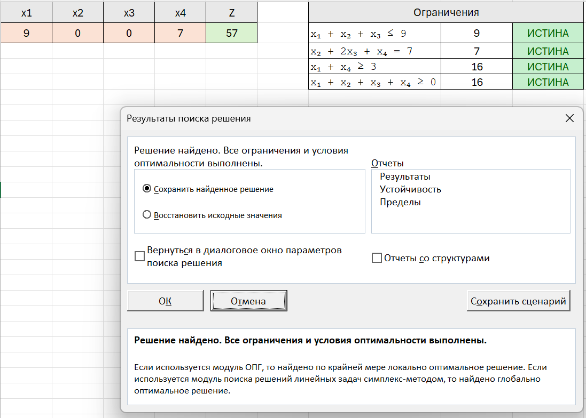

# Лабораторная работа №1 Решение задачи линейного программирования

## Автор
**Ф.И.О.:** Лаптев Егор Игоревич\
**Поток:** МетОпт 1.1\
**Группа:** К3339

---

## Описание
Программа реализует полный цикл решения задачи линейного программирования (ЗЛП) методом симплекс-метода, начиная от чтения входных данных из JSON-файла до получения оптимального решения.

Программа выполняет **полный цикл**:
1. Считывает задачу линейного программирования из JSON-файла;
2. Приводит задачу к **каноническому виду**;
3. Формирует **вспомогательную задачу** (первая фаза);
4. Переходит к **основной задаче** (вторая фаза);
5. Решает её симплекс-методом;
6. Записывает результат в `output.json`.

Цель работы закрепить навыки:
* Построения математической модели ЗЛП (целевая функция и ограничения)
* Приведения задачи к каноническому виду
* Решения вспомогательной задачи
* Перехода к основной задаче и нахождения оптимума
* Реализации решения на языке Python.

---

##  Инструкция по запуску

### Клонирование репозитория
```bash
git clone https://github.com/EgorLaptev/optimization-methods.git
cd optimization-methods
```
### Установка зависимостей
```bash
pip install -r requirements.txt
```

### Запуск программы
```bash
cd lab1
python main.py
```


---

## Вариант задания

**Максимизировать:**
Z = 4x₁ + x₂ + 2x₃ + 3x₄

**При ограничениях:**
  1) x₁ + x₂ + x₃ ≤ 9
  2) x₂ + 2x₃ + x₄ = 7
  3) x₁ + x₄ ≥ 3
  4) x₁ + x₂ + x₃ + x₄ ≥ 0

---

## Краткое описание алгоритма

```md
АЛГОРИТМ Решение_ЗЛП
ВХОД: 
    Целевая функция (вектор C), 
    Ограничения (матрица A, вектор b, знаки неравенств), 
    Тип задачи (максимизация/минимизация)

ВЫХОД: 
    Оптимальные значения переменных x*, значение целевой функции Z*

ШАГ 1. Считать входные данные из файла input.json
ШАГ 2. Преобразовать задачу к каноническому виду:
        - Неравенства "<=" дополнить slack-переменными
        - Неравенства ">=" заменить на равенство с избыточной переменной и искусственной переменной
        - Все b[i] сделать неотрицательными (при необходимости умножить на -1)
ШАГ 3. Сформировать вспомогательную задачу (если присутствуют искусственные переменные)
ШАГ 4. Решить вспомогательную задачу симплекс-методом
ШАГ 5. Если вспомогательная задача имеет решение:
        → перейти к решению основной задачи
    ИНАЧЕ:
        → сообщить, что допустимого решения нет
ШАГ 6. Решить основную задачу симплекс-методом
ШАГ 7. Вывести результат:
        x*, Z*, статус задачи
КОНЕЦ АЛГОРИТМА

```

---

## Структура проекта
```md
├── main.py                # Точка входа
├── simplex_solver.py      # Класс SolveSimplex
├── data/
│   └── input.json         # Входные данные
├── misc/
│   └── solution.xlsx      # Решение через Excel
├── images/
│   └── excel.png          # Фото решения через Excel
└── README.md
```

---

## Формат входных данных
```json
{
  "objective": "max",
  "C": [4, 1, 2, 3],
  "constraints": [
    { "A": [1, 1, 1, 0], "sign": "<=", "b": 9 },
    { "A": [0, 1, 2, 1], "sign": "=", "b": 7 },
    { "A": [1, 0, 0, 1], "sign": ">=", "b": 3 }
  ]
}
```

## Вывод программы
```mk
Оптимальное решение:
x1 = 9.0000
x2 = 0.0000
x3 = 0.0000
x4 = 7.0000
Z = 57.0000
```

## Формат выходных данных
```json
{
  "x_opt": [9.0, 0.0, 0.0, 7.0],
  "Z_opt": 57.0
}
```

## Проверка в Excel
    

Решение через надстройку "Поиск решения" сходится с результатом работы алгоритма

## Рефлексия
Во время выполнения лабораторной работы удалось глубже разобраться с математической постановкой задачи линейного программирования (ЗЛП), понять структуру и взаимосвязь ограничений и целевой функции, а также освоить методы анализа допустимых решений. Практическая часть работы позволила реализовать на языке программирование python симплекс-метод, что дало возможность наглядно увидеть процесс поиска оптимального решения и работы с базисными и небазисными переменными. Кроме того, в ходе работы было закреплено умение приводить задачи линейного программирования к каноническому виду. Также был получен опыт решение ЗЛП при помощи надстройки Excel "Поиск решения". Полученные навыки помогли мне глубже понять теоретические основы ЗЛП.

